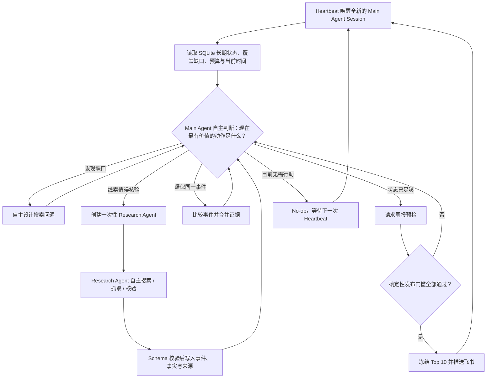
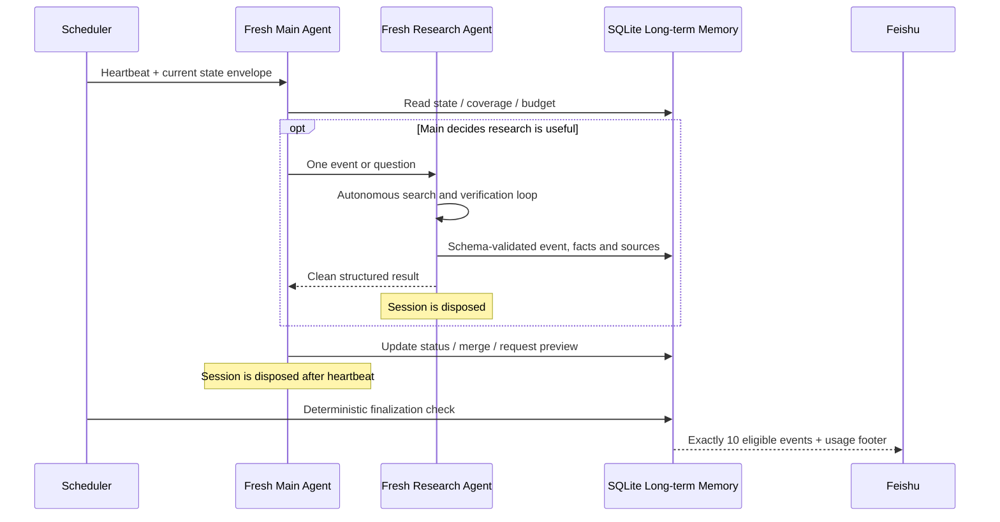

# AI Weekly Brief — Autonomous Agent Loop

一个面向个人使用、可长期运行的 AI 情报系统。它不是把“搜索 → 总结 → 推送”写死的自动化 Workflow，而是由 **Main Agent 在每次 Heartbeat 中读取长期状态，自主判断下一步是否需要搜索、委派研究、去重、继续观察、生成预览或停止**。

系统以现实事件而非文章为单位维护情报，每周从完整自然周中选出 10 个互不重复、有来源且可追溯的重要 AI 事件，通过飞书群机器人推送。每次推送底部会显示模型 Token 用量和费用。

> 当前定位：私人项目，功能完整，但不为高并发、多租户或企业权限体系增加复杂度。

## 为什么这是 Agent Loop

传统 Workflow 预先规定每一步；本项目只规定长期目标、可用工具、预算和安全边界，具体调查路径由 Agent 根据实时状态决定。



Agent Loop 的关键特征：

- Main Agent 每次醒来先观察，再决定是否行动；`No-op` 是合法结果。
- 搜索词、工具顺序、调查深度和是否创建 Research Agent 都不是固定步骤。
- 每个 Research Agent 处理一个问题，自主选择 Search、Safe Fetch 和结束时机。
- 子 Agent 每次重新初始化；干净结果进入 SQLite，聊天上下文不会被当作长期记忆。
- Session 可以丢弃，下一轮仍可根据结构化状态继续，因此能长期运行。
- 代码只负责权限、预算、结构校验、事务、去重保护和发布硬门槛，不代替 Agent 做内容判断。

### 自主不等于失控

| Agent 自主决定 | 程序确定性约束 |
| --- | --- |
| 查什么、何时查、是否继续调查 | 单次最多 30 次工具调用、8 次 Research、15 分钟 |
| 哪些线索值得委派 Research Agent | 每周美元预算和模型权限 |
| 事件是否值得关注、如何评分 | Research 结果必须通过严格 Schema |
| 是否合并、观察或拒绝候选 | SQLite 事务、事件级去重和审计记录 |
| 何时请求预览或停止 | 最终必须恰好 10 条、来源可追溯、置信度合格且互不重复 |
| 调查路径和工具调用顺序 | Agent 不能使用 Shell、任意文件、任意 SQL 或直接推送消息 |

## 已实现能力

- Pi Main Agent + 短生命周期 Research Agent。
- DeepSeek、OpenAI、Claude、Gemini、OpenRouter、Grok、Groq、Mistral、Kimi、智谱等模型选项。
- Tavily、Brave Search 和无费用 Mock 搜索。
- 来源注册表与中国、美国、欧洲、全球及多主题覆盖检查。
- Safe Fetch、SSRF 防护、外部内容不可信隔离和结构化输出校验。
- 以 subject / action / object / time / facts 为基础的事件级去重与证据合并。
- SQLite 长期记忆、运行审计、研究审计、费用记录和一致性备份。
- Top 10 失败关闭：不足 10 条时不会虚构或用低质量内容凑数。
- 飞书 JSON 2.0 卡片、幂等发送和发送结果不确定保护。
- 推送底部展示输入、输出、缓存 Token 与模型 API 美元费用。
- 中文配置向导、常驻调度、单进程锁、异常恢复和脱敏 JSONL 日志。
- Windows、Linux、Docker 和任意 GitHub 克隆目录运行。

## 快速开始

要求：

- Node.js `22.19+`
- 至少一个受支持模型的 API Key；第一次体验也可以全部使用 Mock
- 可选：Tavily 或 Brave Search API Key
- 可选：飞书群自定义机器人 Webhook

```bash
git clone <你的仓库地址>
cd ai-weekly-brief
npm ci
npm run setup
npm run config:check
npm run search:smoke
npm run pi:smoke
npm run notify:test
npm start
```

Windows 如果 PowerShell 禁止运行 `npm.ps1`，不需要修改系统策略，使用 `npm.cmd`：

```powershell
npm.cmd ci
npm.cmd run setup
npm.cmd start
```

配置向导会在当前项目根目录生成 `.env`。项目不依赖 C 盘、用户名或固定绝对路径，移动文件夹或从 GitHub 重新克隆后仍可运行。

完整的新手操作说明见 [README_启动指南.md](./README_启动指南.md)。

## 推荐的首次验证

先用 Mock + `DRY_RUN` 验证本地运行，再接入真实服务：

```powershell
npm.cmd run setup
npm.cmd run config:check
npm.cmd run search:smoke
npm.cmd run pi:smoke
npm.cmd run notify:test
```

使用 DeepSeek + Tavily 生成并立即推送 1–10 条真实质量测试内容：

```powershell
npm.cmd run quality:test -- 3
```

这条命令会产生真实 API 用量，但不会把测试事件写入正式候选库。飞书消息底部会显示本次模型 Token 和费用，不包含 Tavily 搜索费用。

## 运行 Agent Loop

手工唤醒一次 Main Agent：

```powershell
npm.cmd run heartbeat
```

长期运行：

```powershell
npm.cmd start
```

程序启动后会立即执行一次 Heartbeat，之后按照 `.env` 中的 `HEARTBEAT_TIMES` 唤醒。按 `Ctrl+C` 停止。

本地电脑关机、休眠或终端关闭后，程序无法继续运行。需要全天在线时，应部署到云服务器：

```bash
cp .env.example .env
# 编辑 .env，填入自己的密钥和飞书 Webhook
docker compose up -d --build
docker compose logs -f
```

## 发送模式

- `DRY_RUN`：允许调查和预览，禁止正式推送。
- `APPROVAL`：周报通过预检后，等待你执行 `brief:send`。
- `AUTO`：到配置的发布时间后自动检查并推送上一个完整自然周。

建议先运行一周 `DRY_RUN`，再使用 `APPROVAL`，确认质量后切换到 `AUTO`。

## 常用命令

| 命令 | 用途 |
| --- | --- |
| `npm run setup` | 中文交互式配置 |
| `npm run heartbeat` | 手工执行一次 Main Agent Loop |
| `npm run quality:test -- 3` | 真实生成并推送 3 条质量测试 |
| `npm run status` | 查看健康状态、候选数、Token、费用和预算 |
| `npm run history -- 20` | 查看最近的 Agent 运行审计 |
| `npm run coverage:status` | 查看来源、地区和主题覆盖 |
| `npm run brief:preview` | 预览周报及未通过的门槛 |
| `npm run brief:finalize` | 硬校验并冻结 Top 10 |
| `npm run brief:send` | 推送已通过最终校验的周报 |
| `npm run backup` | 创建并校验 SQLite 备份 |
| `npm run models:list` | 查看模型提供商和模型 ID |
| `npm test` | 构建并运行完整自动化测试 |

## 数据与 Agent 生命周期



长期保存的是结构化事件、事实、来源、状态、运行和费用，不是 Agent 的整段聊天记录或网页全文。

## 项目结构

```text
src/
  agent/          Main Agent Loop 与受控工具
  research/       Research Agent、终止工具与 Schema
  search/         Tavily / Brave / Mock 搜索适配器
  fetch/          安全网页抓取与 SSRF 防护
  events/         事件、事实、来源和状态持久化
  dedup/          事件关系判断与证据合并
  brief/          Top 10 预检、冻结与 Markdown 渲染
  notifications/ 飞书卡片和幂等发送
  quality/        真实内容质量测试入口
  usage/          Token 与费用尾注
prompts/          Main / Research Agent Prompt
tests/            自动化测试
data/             SQLite、备份和临时运行状态（不提交 Git）
logs/             脱敏运行日志（不提交 Git）
```

## 安全与隐私

- `.env`、`.env.backup-*`、数据库、备份、日志、预览和运行时目录均被 `.gitignore` 排除。
- API Key 和飞书 Webhook 不写入 Prompt、SQLite 或日志。
- Main Agent 没有 Shell、任意文件、任意 SQL 和任意消息发送权限。
- Research Agent 只能使用受控 Search、Safe Fetch 和结构化提交工具。
- 网页中的指令一律视为不可信数据，不能改变 Agent 的系统规则。
- 飞书发送超时会进入 `UNKNOWN` 状态并阻止盲目重发，避免重复周报。

提交或公开仓库前，仍应运行 `git status`，确认 `.env` 和 `data/` 没有进入暂存区。

## 开发与验证

```bash
npm ci
npm run typecheck
npm test
```

Prompt 位于：

- [Main Agent Prompt](./prompts/main-agent.v0.1.md)
- [Research Agent Prompt](./prompts/research-agent.v0.1.md)

修改 Prompt 后建议提升版本号，并先在 `DRY_RUN` 中观察至少一个完整周期。
